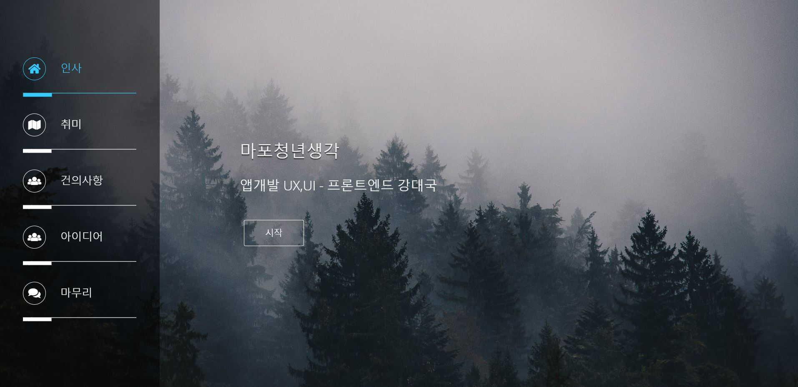

마포청년일자리 사업을 시작한지 2주가 조금 넘었다.

마포구에서 준 과업(공공기관에선 프로젝트를 과업이라 칭한다)이 바로 청년생각이다.

마포구에 관한 아이디어, 건의사항등을 생각해 발표하는 것이다.

전체적 구상 -> 구체적 내용 -> ppt 구상 -> html 웹페이지 제작 -> html templete 이용 웹페이지 제작 순으로 만들었다.

templete을 쓰니까 기본적인 구성을 코드로 읽는게 어려웠고, 아무래도 자바스크립트를 아직 몰라서 알 수 없는 부분들이 많았다. 

<h2>느낀점</h2>

다른 분 발표에서 마포구에 관해 조사랑 생각을 많이 했다는 것을 알 수 있었다. 본인의 아이디어를 어떻게 해나갈지 구체적으로 정리한 분들도 보였다.

그래선지 스스로 좀 부족했다는 생각을 했다. 그래도 발표도 생각보다 말이 잘 나와서 무리없이 했고, 과업준비하면서 html,css 공부도 할 수 있어 만족스러웠다. 

(거의 4시간동안 앉아서 발표듣는게 가장 힘들었다....)

코드들은 [https://github.com/umcondo/MapoThink](https://github.com/umcondo/MapoThink)에 정리하였다.