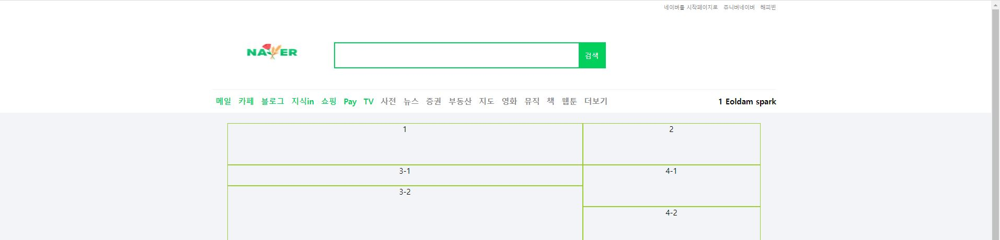
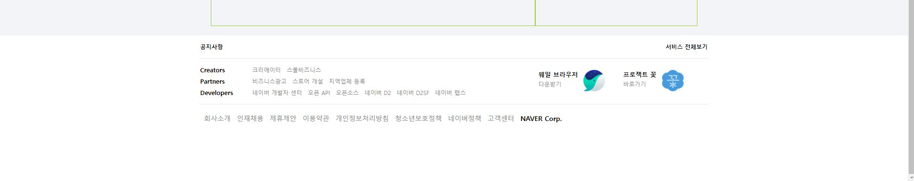
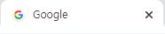
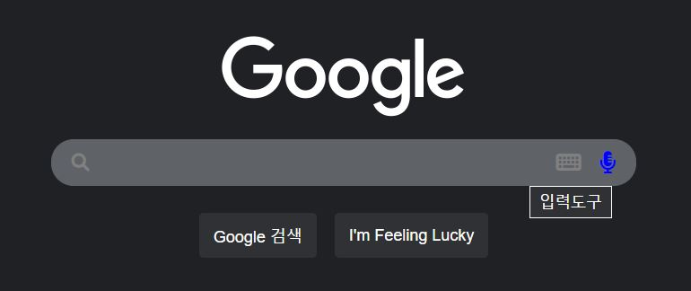
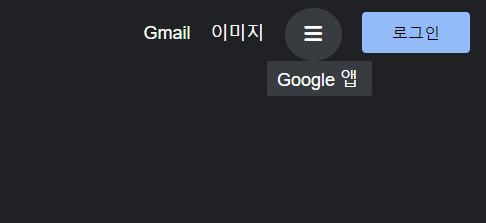
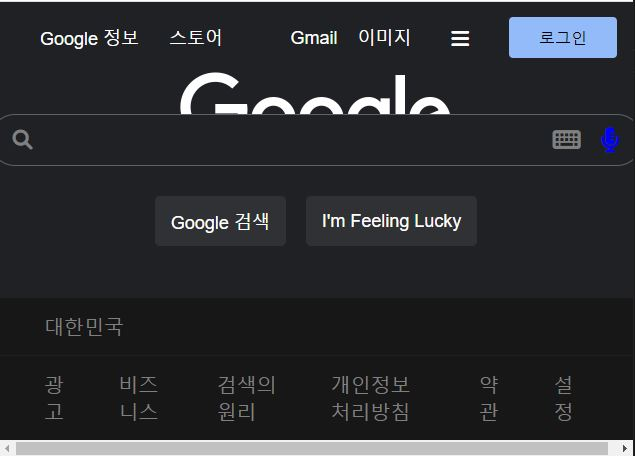
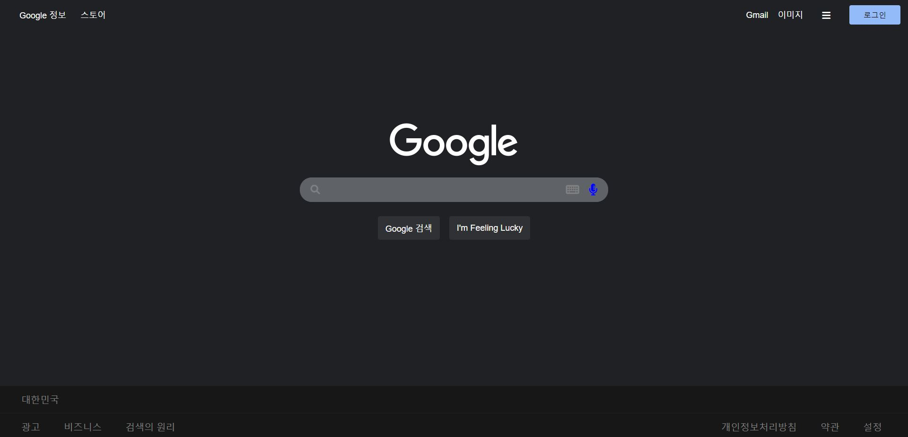

html, css를 손에 익히고, 공부할 겸 네이버, 구글 클론 코딩을 해보았다.

<h2>네이버 클론코딩</h2>

[https://codingbroker.tistory.com/115](https://codingbroker.tistory.com/115) 블로그를 참고해서 클론코딩을 했다.

header, main, footer로 나누어 작업하는 것과 flex, grid에 대해 알 수 있었다.

코드들은 깃허브 [https://github.com/umcondo/NaverCloneCoding](https://github.com/umcondo/NaverCloneCoding)에 정리했다.

<h3>header</h3>

<h3>main</h3>

<h4>footer</h4>

<h2>구글 클론코딩</h2>

네이버 클론코딩과 html, css공부한 것을 바탕으로 구글 클론코딩을 참고없이 직접해보았다.

막히는 부분은 google 홈페이지를 크롬개발자도구를 이용해 알아보았고, 모르는 태그는 구글 검색으로 찾았다. 

flex 다루는 법을 익힐 수 있었다.

이번엔 favicon도 넣었다.

<h3>구현중에 제일 재밌었던 점</h3> 

아래 그림과 같이 검색 창에서 마이크에 커서가 가면 밑에 상세설명이 나오게하는 것이었다. (마이크,키보드는 폰트어썸에서 받았다)

w3cschool에서 how-to -> dropbox 부분을 참고하여 position:absolute와 :hover, display:block, display:none을 이용해서 만들었다.

<h3>부족했던 점</h3>

반응형으로 구현할수는 없어 다음과 같은 문제가 생겼다.

앞으로 반응형css에 대해 공부해야겠다.       

<h3>전체 이미지</h3>

코드들은 깃허브 [https://github.com/umcondo/GoogleCloneCoding](https://github.com/umcondo/GoogleCloneCoding)에 정리했다.