> 마포청년일자리 사업에서의 1차 과업 초안을 작성했다.

&nbsp;1차 과업은 대략 5월 말쯤에 발표를 하게 되었다. 마포에 관련된 싱글페이지 웹사이트를 vanilla js를 이용해 만드는 것이 기본이다.
개발은 혼자 진행되며 4월까지 기획, 와이어프레임, 스토리보드을 하고 5월부터 본격적인 개발이다.
개발팀은 리액트를 이용해서 웹사이트를 다시 만들어보는 것까지 해야하고, 더 나아가 다른 웹사이트를 더 만들거나, 혹은 협업을 해도 된다고 했다.

  &nbsp;내 주제는 망원동 주변의 러닝코스를 추천해주는 웹사이트다.
질문을 던지고 그걸 토대로 러닝코스를 추천해주는 시스템인데 코끼리 https://myanimal.kokkiri.kr 등 심리테스트 사이트들을 많이 참고했다.

  &nbsp;개발은 먼저 노트에 대략적으로 기획 및 레이아웃, 동작원리 등을 짰다. 일단 한번 만들어보고 싶어서, 스토리보드랑 와이어프레임은 생략했다.
얼추 나오긴 했는데 동작을 짠 코드도 엉망이라 마음에 안들고 레이아웃, 기획, 데이터, 애니메이션 등 부족한 점이 많았다.

  &nbsp;PM님이 기획서 및 와이어프레임을 작성해보라고 해서 초안을 만들어보았다.

- <h1>기획서 초안</h1>
    - <h2>기획</h2>
  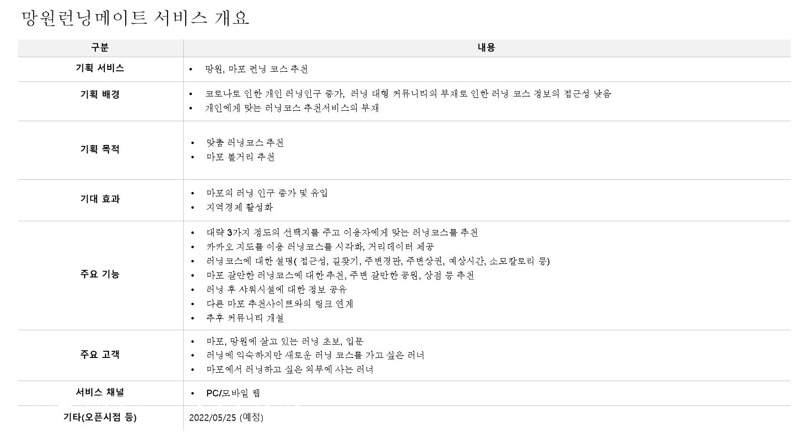
    - <h2>유저플로우</h2>
  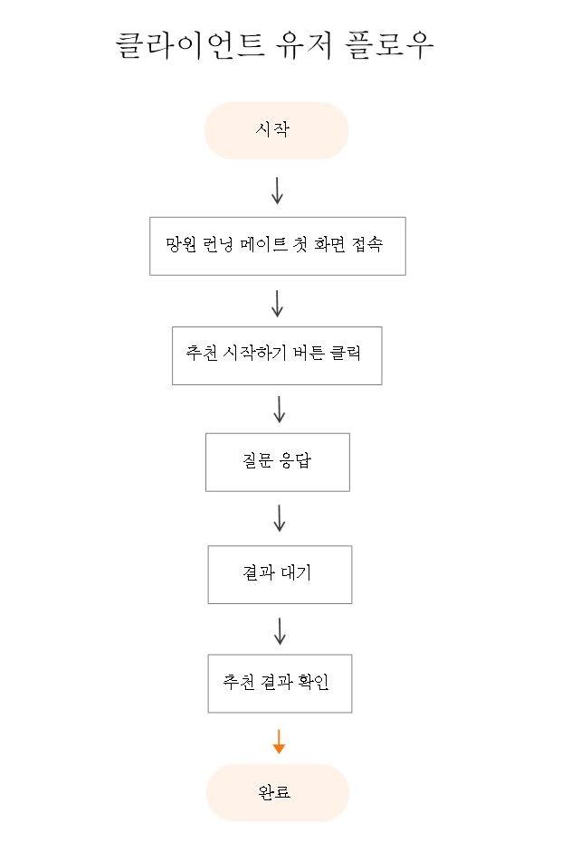
    - <h2>스토리보드</h2>
  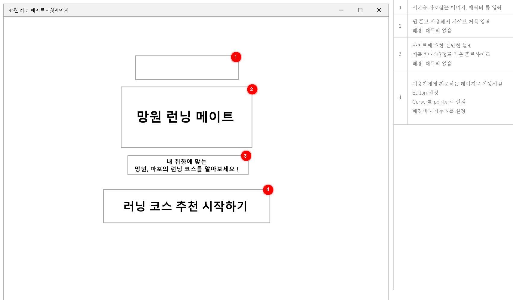
  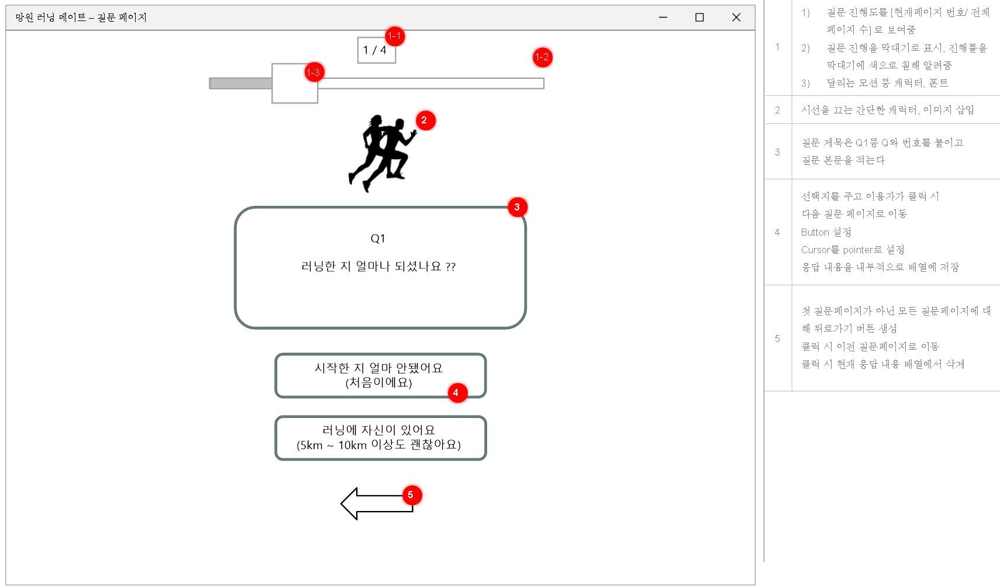
  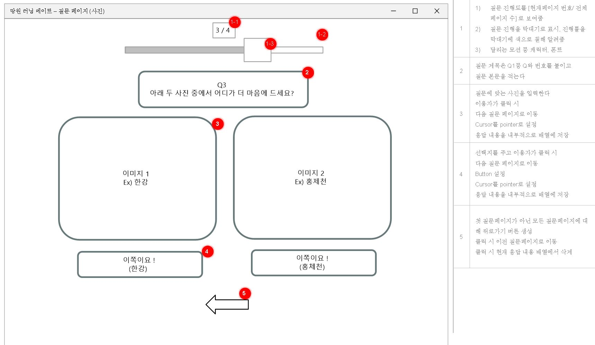
  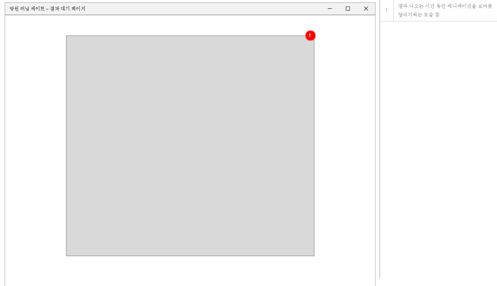
  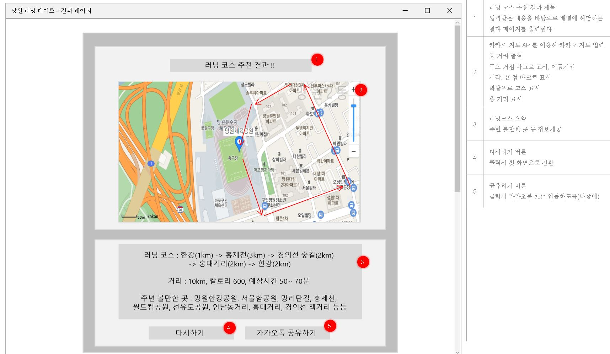

- <h1>구현화면(미완)</h1>
  
  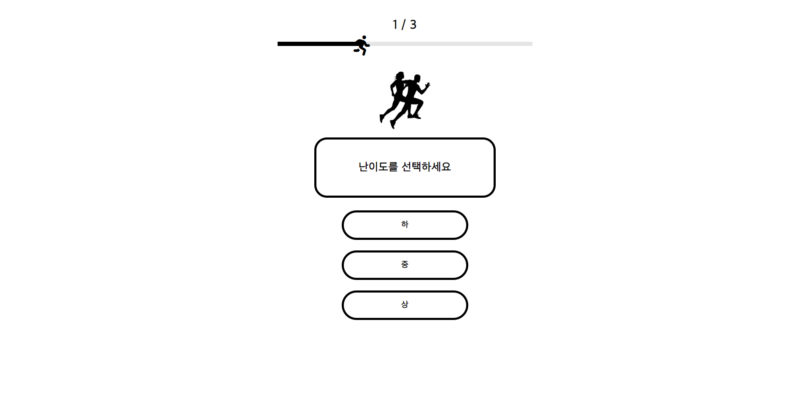
  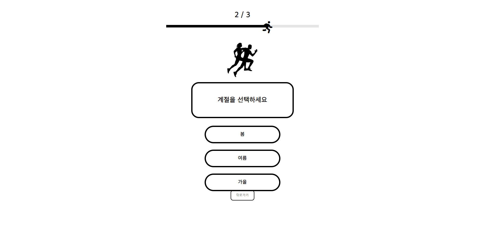
  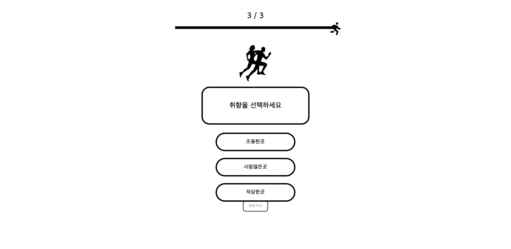
  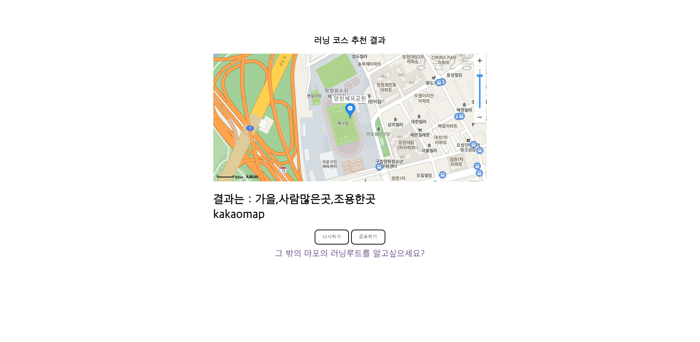

&nbsp;갈길이 멀다는 느낌이 든다. 다음주에는 데이터보완(질문지, 추천코스, 추천코스설명, 로고, 캐릭터) 및 카카오지도API 구현, 동작방식 코드 리팩토링, 질문방식 등을 해야한다.

  &nbsp;초안 구현이 완료되면 레이아웃, 색을 보완하고 싶다. 애플, 나이키런의 색감을 원하는 데 잘될지는 모르겠다.
질문지에 애니메이션도 넣어보고 싶다. 또 반응형으로 만들어 모바일로 볼때도 어색하지 않게 만들고 싶다. 코드리뷰를 통해 로직도 좀 더 깔끔하게 만들고 싶다.
시간이 된다면 브라우저 호환성 문제에 대해서도 한번 생각해보고 싶다.

> 그나저나 마크다운으로 블로그 포스팅하는게 정말 만만치 않다...
