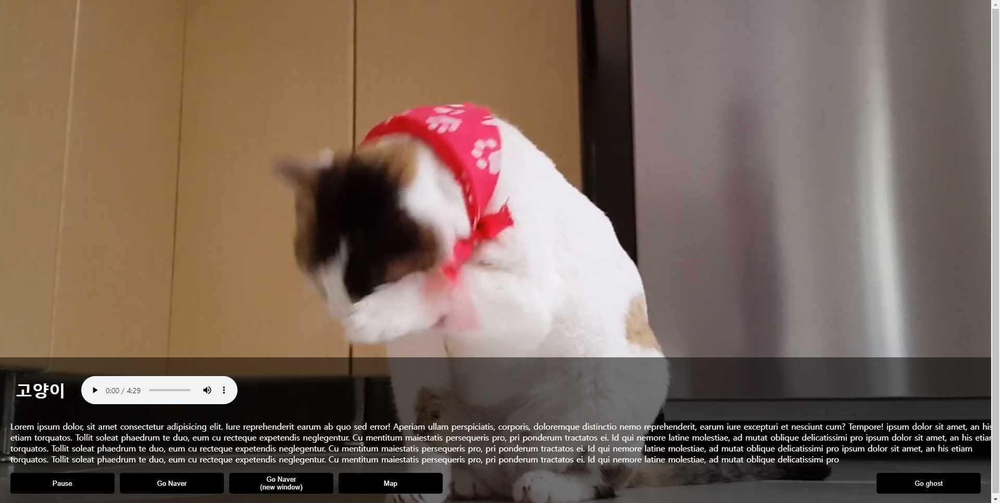
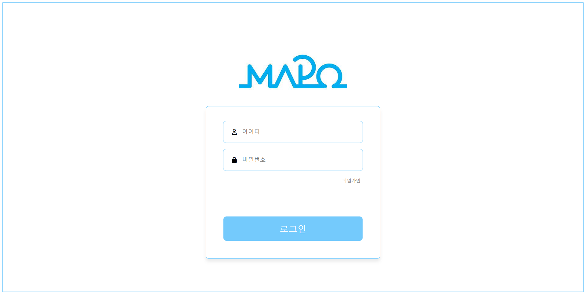
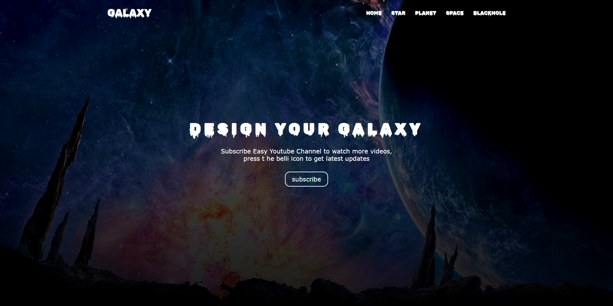
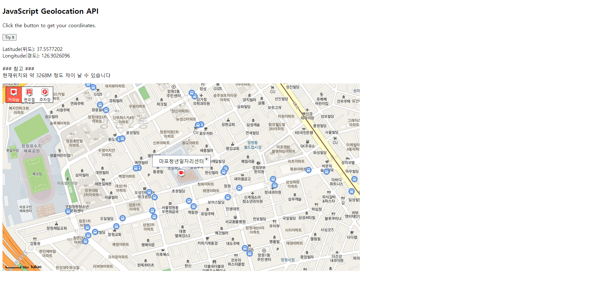

일과시간에 HTML,CSS,JAVASCRIPT를 학습하며 만들었던 것들이다.

배포는 GITHUB와 연동하여 netlify를 이용하였다.

코드는 깃허브에 올려두었다. [https://github.com/umcondo/NetlifyStorage](https://github.com/umcondo/NetlifyStorage)

1.  <h2>고양이사이트</h2>
    

    배경으로 비디오를 넣어보고 오디오 태그 사용 및 input 태그를 학습했다.

    배포 : [https://umcondostorage.netlify.app/cat.html}(https://umcondostorage.netlify.app/cat.html](https://umcondostorage.netlify.app/cat.html)

2.  <h2>마포회원가입, 마포로그인페이지</h2>
    

    회원가입, 로그인 페이지를 임의로 html,css를 이용해 만들어보았다.

    회원가입 : [https://umcondostorage.netlify.app/mapo_join](https://umcondostorage.netlify.app/mapo_join)

    로그인 : [https://umcondostorage.netlify.app/mapo_login.html](https://umcondostorage.netlify.app/mapo_login.html)

3.  <h2>3D 버튼</h2>
    

    수코딩 유튜브를 보고 클론 코딩했다.

    css transform을 이용한 3D 조작을 경험해 볼 수 있었다. 4D인 테서렉트를 자바스크립트로 구현한 것까지 찾아보았다.

    배포 : [https://umcondostorage.netlify.app/3dbutton](https://umcondostorage.netlify.app/3dbutton)

    유튜브 참고 주소 : [https://www.youtube.com/watch?v=hFvPP53kldk](https://www.youtube.com/watch?v=hFvPP53kldk)  
    테서렉트 : [https://honzukka.github.io/tesseract_demo/index.html](https://honzukka.github.io/tesseract_demo/index.html)

4.  <h2>웹페이지 연습</h2>
    

    html,css로 간단한 싱글웹사이트 템플릿을 만들었다. 배경이미지의 용량이 30MB나 되어서 로딩하는데 오래걸리는 문제가 생겨버렸다...

    배포 : [https://umcondostorage.netlify.app/galaxy_page.html](https://umcondostorage.netlify.app/galaxy_page.html)

5.  <h2>카카오지도 API</h2>
    

    카카오에서 지도 API를 가지고 와서 마포일자리센터의 위치를

    지도에 찍어보았다. API사용법과 DOM 조작을 익혔다.

    배포 : [https://umcondostorage.netlify.app/map.html](https://umcondostorage.netlify.app/map.html)
