> 1차 과업을 마무리했다.

배포주소 : [https://umcondo.github.io/mangwon_running_mate](https://umcondo.github.io/mangwon_running_mate) 
깃허브 : [https://github.com/umcondo/mangwon_running_mate](https://github.com/umcondo/mangwon_running_mate)

## 이번에 수정된 부분은 다음과 같다.

- 시작페이지 윗부분 캐릭터 사진을 애니메이션으로 바꿔 더 눈에 띄게 하였다.
- 시작페이지에 푸터를 추가하여, 제작자를 밝히고 마포구 로고, SNS를 추가하였다.
- 시작, 질문, 결과 페이지에 포인트색(주황색)을 추가하여 중요 멘트, 버튼에 포인트를 줬다.
- 결과페이지 제목부분을 수정하였다.
- 결과페이지 공유하기를 modal방식으로 구현하였고, 링크복사, 카카오톡 공유 기능을 구현했다.
- 리액트로의 변환

## 리액트 변환은 완료했으나 최적화는 아직이다.

- useNavigate를 이용해 page를 시작/질문/결과 페이지로 나누었다.
- 리액트에 대한 이해도 부족해서 단순히 기능 구현만 해놓았다.
- 리액트를 쓰면서 어떤점이 개선되었는 지를 찾아봐야한다.
- 컴포넌트 간의 렌더링 최적화가 필요하다.

## 버그, 오류 기록

### 1) 해결된 것

<h2>** 의도하지 않았으나 생긴 것 </h2>

- 사파리, settimeout, display:block 애니메이션 오류 (setTimeout이 제대로 작동하지 않아 화면이 남아있음
  - 화면이 로딩되는 동안 애니메이션을 보여주려고 로직을 짰는데, 이 버그때문에 애니메이션 페이지 보여주고 2초 후 결과페이지를 display:block 하는 방식으로 변경
- 반응형 크기 줄이면 맨 위의 요소들이 잘리는 현상 - flex, justify-content: center로 인한 오류

  - justify-content를 기본(flex-start)으로 주고, 하위 요소(item)들에 flex-grow를 준 뒤 padding을 줘서 레이아웃은 똑같이 하되 창을 줄였을 때 위의 내용이 잘리지 않고 스크롤이 생기게 함.

- 웹폰트, 이미지가 늦게 로딩되는 현상

  - preload를 사용

- css 파일 가독성을 위해 분리 → 로딩 느려짐 -> css 파일 합치기(import 방식) -> 병렬적 css다운로드 불가능

  - 병렬적인 css 다운로드를 위해 html link 태그 방식 사용 ( 렌더링 최적화)

- 전체 화면의 height를 100vh로 했을때 핸드폰 아래 기본 푸터를 인식하지 못해 여백이 생김
  - height를 100%로 바꿔서 해결
- 높이가 작은 핸드폰에 결과페이지가 잘리는 오류(기본적인 핸드폰 주소창 등으로 인해 결과내용이 가려져서 안보임)
  - 미디어쿼리로 특정 height에서 height를 130%로 만들어 해결
- 마포sns로고 사이의 공백 -> 인라인 요소 사이 공백 → 태그 사이 줄바꿈으로 인한 공백을 브라우저가 읽어버려서 나타나는 현상

  - flex, gap으로 해결,

- css hover가 핸드폰에서 지원되지 않아 핸드폰에서 두번 클릭되는 등의 오류 발생

  - media쿼리의 hover,pointer를 활용하여 핸드폰에서는 hover를 실행되지 않도록 함

<h2>** 의도했으나 의도대로 되지 않은 것</h2>

- html 페이지 하나로 개발하여 공유하기로 결과페이지 url를 복사하여 붙여넣기를 하면 결과페이지가 보여지는 것이 아니라 시작페이지부터 보인다.

  - 리액트에서 useNavigate를 통해 페이지를 나누었다. 결과페이지 url을 domain/result로 하여 해결하였다.

- 옛날 커밋 정리하려고 rebase쓰다가 최근 커밋으로 추가만 되고 커밋들이 정리되지 않았다.

  - reset --hard로 새로 만들어진 커밋 싹 날리고 기존 커밋까지로 push -f하였다. rebase -i squash로 옛날 커밋
    여러개를 하나로 합치고 다시 push -f하였다.
  - 이 과정속에서 커밋들이 머지되고 conflict하면서 엉망이 되었다.
  - 커밋을 신중하게 해야하고 예전 커밋들을 고치는 것은 rebase를 통해해야하며 rebase는 커밋로그를 새로 만드므로 협업과정에서는 지양해야한다는 점을 알게 되었다. - 개인작업에서는 커밋을 깔끔하게 하기 위해 reset을 쓸수 있지만 협업에서는 안전하게 revert를 쓰는게 나아보인다. 이런일이 협업에서 일어나지 않아 다행이었다.

### 2) 해결 X -> 아쉬운 점

- 브라우저 호환성
  - 파이어폭스 폰트 깨짐
- 폰트 자체적인 크기로 위아래 여백이 있어 버튼에 글자 입력시 버튼 위아래 여백간격이 균일하지 못한 오류
  - 위 아래 패딩을 다르게 함
    - 크롬 데스크톱 브라우저에선 정상적으로 보이지만 다른 브라우저나 핸드폰에서 여백이 다르다.
      - 아직 해결못함
- 공유하기, 링크복사 로직에 대한 정확한 이해 부족(소스 코드 복붙…)
  - execCommand API, kakao 공유하기 SDK
- 카카오맵으로 현재 위치 받아오는 기능이 실시간으로는 지원되지 않음
  - 웹의 한계인지 추가적인 학습필요, 리액트를 이용한 네이버지도 및 어플에선 실시간 위치가 구현되어 있다..
- png → webp로 변환 파일용량 감소
  - 사파리와 호환성 문제로 png로 다시 돌아옴
- 리액트 최적화

## 추가할 점

- 거점 클릭시 카카오지도로 이동
- 결과페이지에 결과코스와 관련된 사진 추가
- 실시간 현위치를 계속 받을 수 있도록 로직 변경
- 공유하기 버튼에 다른 SNS 추가
- 근처 샤워장, 화장실등 편의시설에 대한 정보 제공

## 과업을 통해 알게된 점

- source code style

  - 주석
    - 함수, 페이지별 설명, 한줄 주석, 여러줄 주석의 분리
  - css
    - class naming, file 배치
  - js
    - 변수 naming, 통일성
    - 가독성
        

- git

  - git은 버전관리 프로그램이므로 한 커밋당 하나의 기능 구현을 해야함
  - 이전 커밋 합치기

    - rebase -i, squash

  - 커밋 되돌리기
    - 이전 커밋들 지워짐 reset --soft, --mixed, --hard
    - 이전 커밋들 놔두고 새로 커밋 생성 revert
  - 뭔가 빠뜨리고 커밋했을때

    - --amend

  - 커밋을 덮어쓰고 싶을때
    - push -f
        

- css

  - 반응형
    - media 쿼리, flex
  - 브라우저마다 다른 렌더링 방식에 대한 경험
    - 폰트마다 다른 렌더링
  - 애니메이션
    - keyframe을 이용해 각 부분별 크기, 위치 조정
        

- js

  - 로직 함수화
  - DOM API
    - DOM 조작
      - appendChild(노드객체) -> append(노드객체 or 텍스트), prepend
      - innerText(css에 종속적이므로 느림) -> textContent
      - innerHTML로 노드들을 일일이 추가하면 그때마다 렌더링을 다시해야한다. createElement로 요소들을 넣어 노드를 새로 만들어 추가하는 것은 렌더링을 한번만 하면 되므로 더 좋다.
  - event
    - event
      - 브라우저 화면내에서 일어나는 사건
    - eventhandler
      - event 발생 시 실행되는 코드
    - eventbubbling
      - event 발생 시 브라우저가 해당요소뿐만 아니라 부모요소를 거쳐 최상위 요소까지 eventhandler가 있는지 확인하는 것
    - eventbubbling을 중단하는 법
      - e.stopPropagation()를 부모요소에 추가한다.
  - 배열, 객체
    - json형태로의 데이터 객체 화
        

- react
  - 컴포넌트 단위로 UI제작 편함(재사용성, 수정편함)
  - 가상돔 사용으로 브라우저 리소스를 덜 사용 -> 렌더링 최적화
  - JSX를 사용해서 dom조작, html, js를 같이 쓰기 더 편함
  - SPA에 적합하고 CSR을 사용한다. 서버 부하를 줄이고 서버와의 할일을 분리하여 더 효율적인 앱관리 가능
      
- 브라우저
  - 렌더링 과정
    - html 로드 -> html파싱, css 로드, css 파싱 -> dom 트리, cssom 트리 형성 -> 렌더 트리형성 -> 렌더링
  - 최적화
    - dom 조작 적절하게, 파일용량줄이기, 파일 link 순서 적절하게, 파싱과정을 최적화하기위해 html, css, js파일의 분리 - inline 형식 최대한 배제
  - 호환성
    - 사파리, 크롬, 파이어폭스, 오페라, 모바일 버전, IE는 제외

# 전체적인 이미지

### 데스크탑

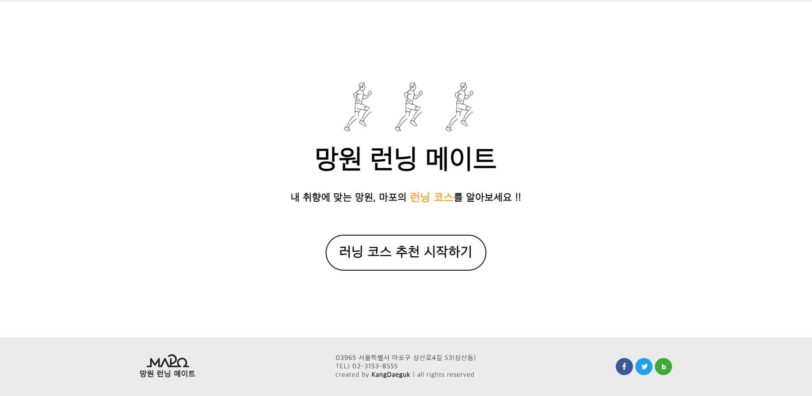
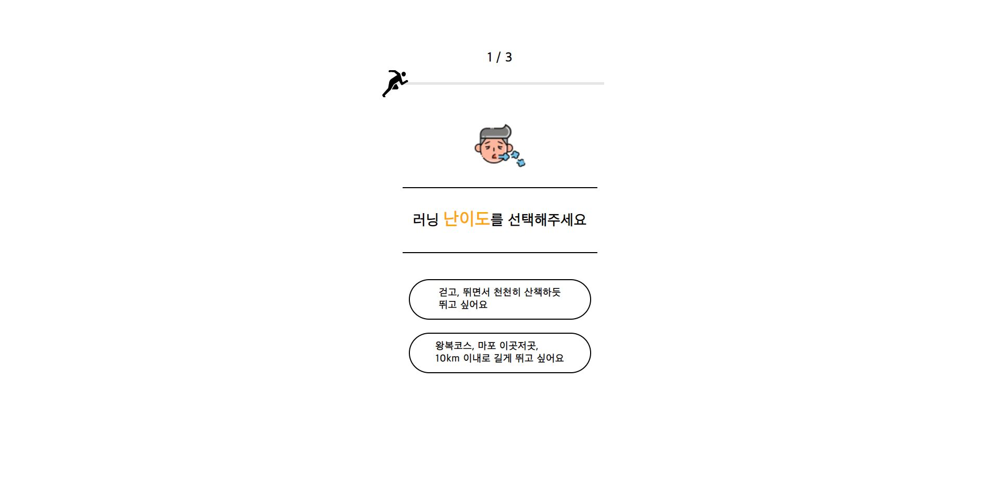
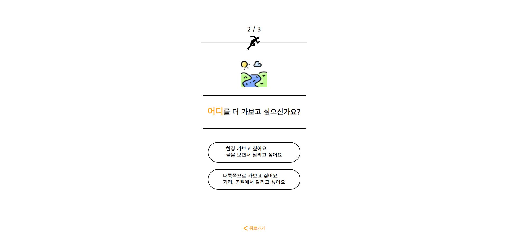
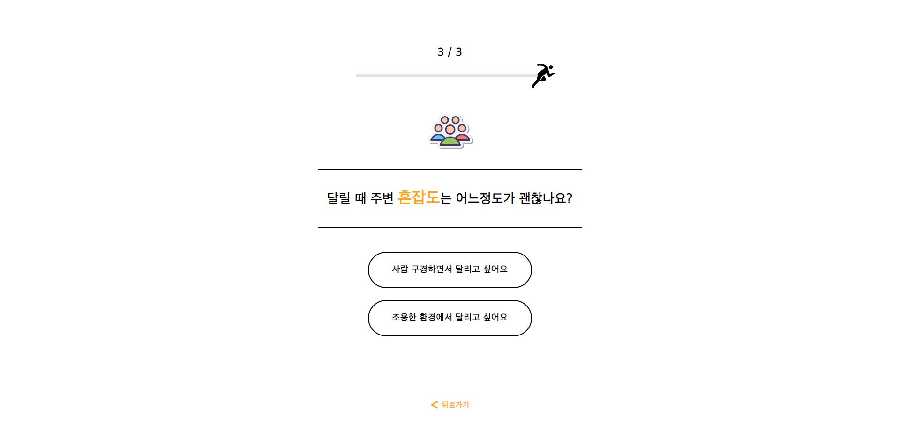
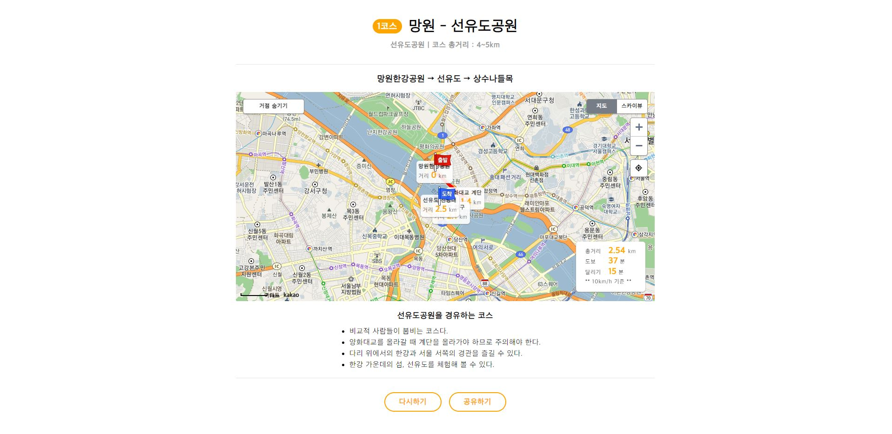
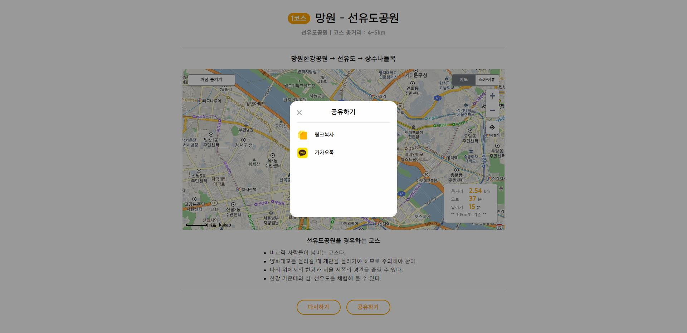

### 모바일

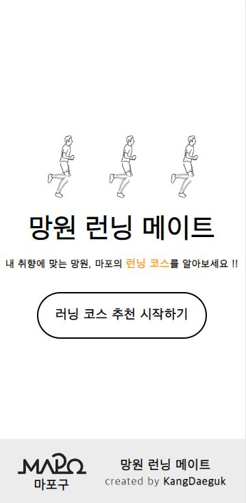 
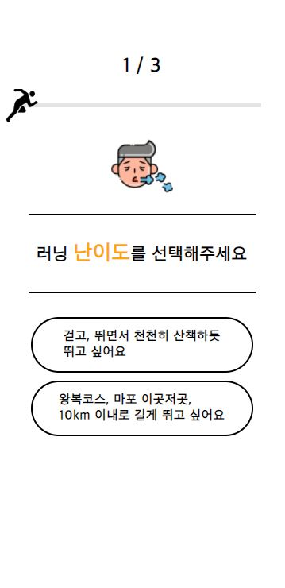 
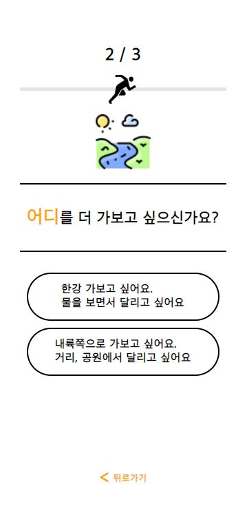 
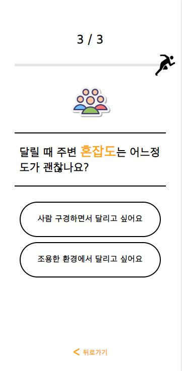 
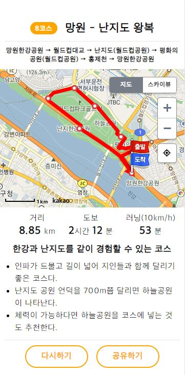 
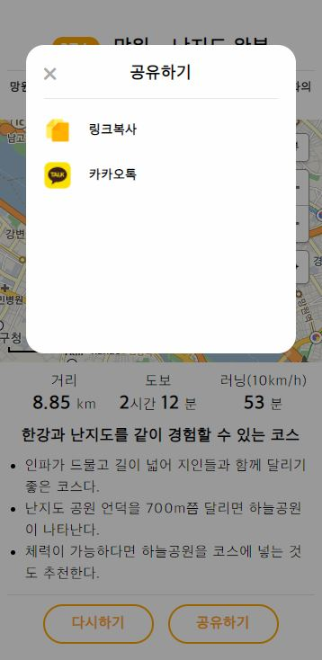
