> 망원 러닝 코스 추천페이지 보완 중

배포주소 : [https://mangwonrunningmate.netlify.app/](https://mangwonrunningmate.netlify.app/) 
깃허브 : [https://github.com/umcondo/mangwon_running_mate](https://github.com/umcondo/mangwon_running_mate)

## 이번에 고려한 부분은 다음과 같다.

- 모바일 와이어프레임 작성 및 전체적 와이어프레임 수정
  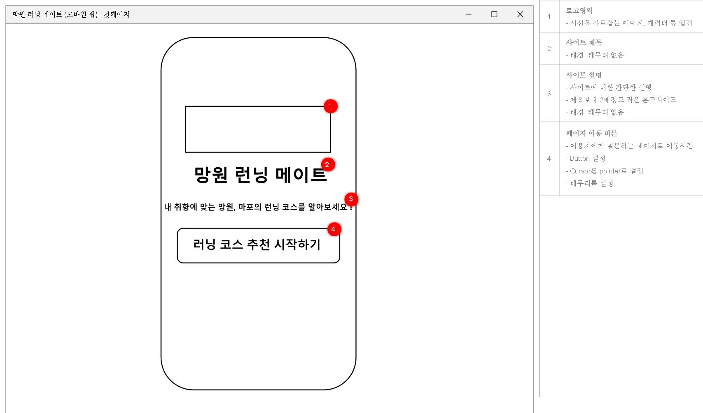
  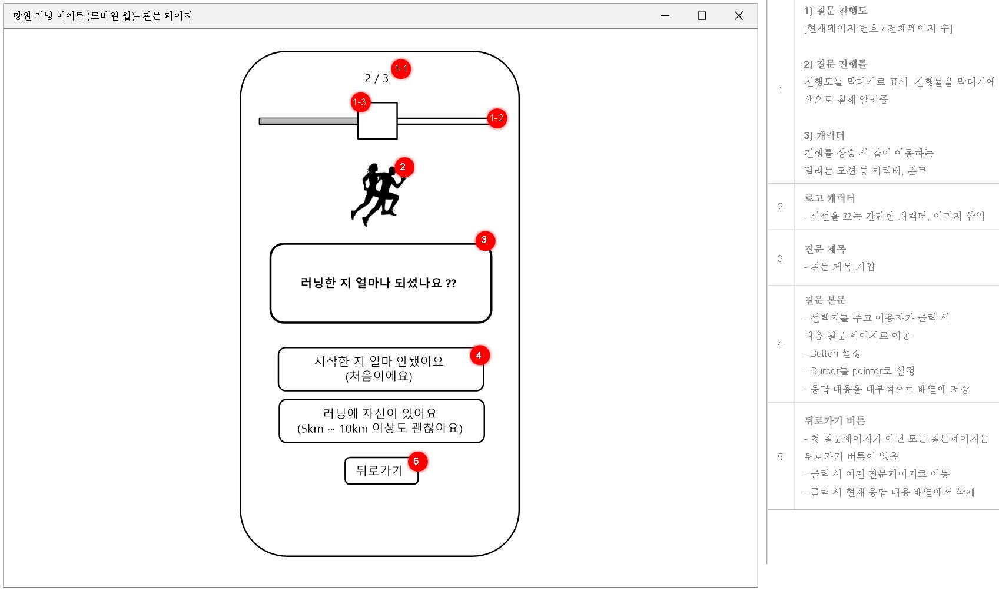
  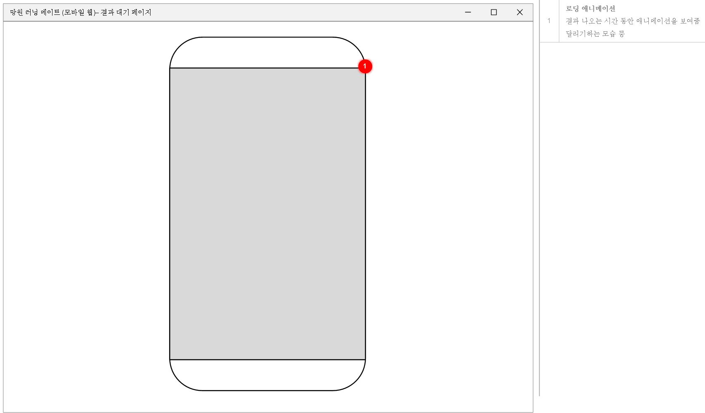
  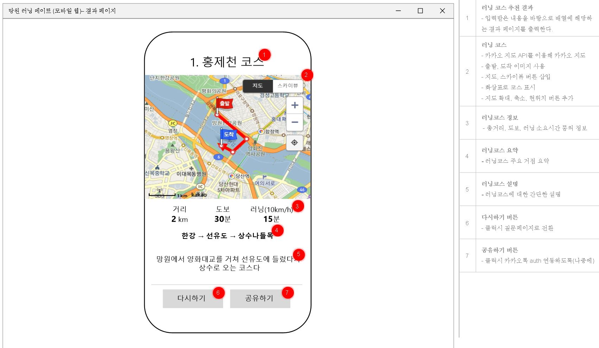
    
- 최적화 - 페이지 로딩시간 등
  - 현재 font를 tff -> woff로 변경, preload 해놓음
  - js를 쓰는 이미지들도 사용자가 바로 볼 수 있도록 preload 함
  - 로딩 시간은 [https://pagespeed.web.dev/](https://pagespeed.web.dev/)에서 확인했다.
  - 모바일 성능은 66점, 데스크톱은 90점이 나왔다. 추후 모바일 성능을 더 올려야한다.
      
- 다른 브라우저(특히 IE) 고려
  - 2022년 5월 현재 한국 IE 점유율은 0.9%으로 이번 과업에서 크게 신경쓰지 않아도 될 것으로 생각됨. 러닝 하는 연령대를 생각해보면 더 괜찮을 것으로 예상됨
  - 스탯카운터 코리아[https://gs.statcounter.com/browser-market-share/all/south-korea](https://gs.statcounter.com/browser-market-share/all/south-korea)에서 확인했다.
      
- css 관련
  - 파비콘 추가
  - 모바일 반응형
    - 모바일로 보는 사람이 더 많을 것으로 생각됨. 모바일을 위한 반응형 페이지 필요성
  - 시작 페이지 로고 추가
  - 결과페이지 설명, 버튼 css
  - 결과로딩 애니메이션 변경
    - 코남[https://blog.naver.com/co-nam/222190411502](https://blog.naver.com/co-nam/222190411502)님의 달리는 애니메이션을 기반으로 더 보완하여 만들었다.
  - 카카오 지도
    - 현재 위치 버튼 추가
    - 선 속에 진행방향추가
    - 스크롤에 따른 지도 변화(panto)
    - 주요 거점 오버레이
    - 총 코스 거리 및 소요시간 오버레이
    - 출발, 도착 지점 이미지 삽입
    - 거점 숨기기 버튼 추가
        
- js 관련
  - 데이터 객체 이용
  - 전체적 로직 함수화
      
- 코드 리팩토링
  - css 클래스 명 더 직관적이게
      

## 디자인 관련

- 질문페이지
  - 선택지 멘트 정리
  - 질문지 제목 라운드 제거
  - 선택시 오버 디자인 변경 ( 검, 흰 등)
  - 뒤로가기 버튼 < 추가 더 직관적으로 변경 및 본문과 거리 벌리기
- 결과페이지
  - 제목 밑에 굵은 밑줄 추가
  - 다시하기 버튼, 공유하기 버튼 등 초록색? 색깔 변경해보기

## 앞으로의 계획

~ 11일(대략) 2차 // ~ 22일(대략) 3차 - 리액트로 변환 // ~25일(발표날) - 문서 작성

## 보완할 것들

- 결과 페이지에 러닝코스 사진 추가(modal 이용)
- 카카오지도 주요거점 클릭시 해당 거점 카카오지도로 보여주기
- js 함수 더 깔끔하고 직관적으로 변경
- 배포시엔 css파일 합쳐 렌더링 최적화

# 전체적인 이미지

### 데스크탑

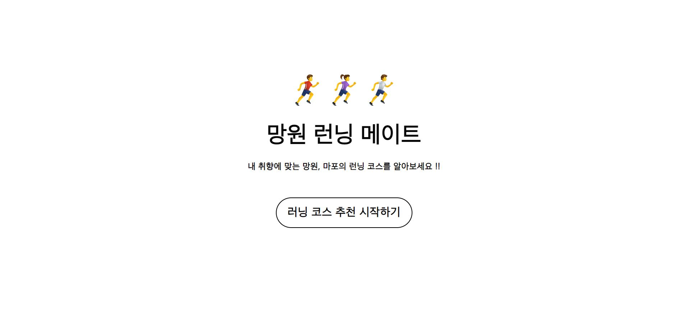
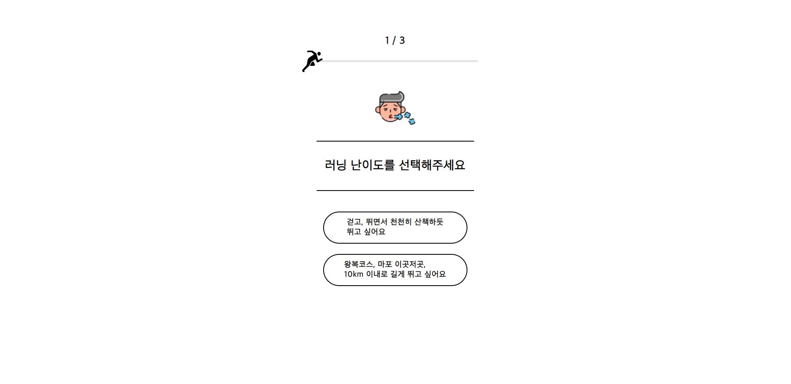
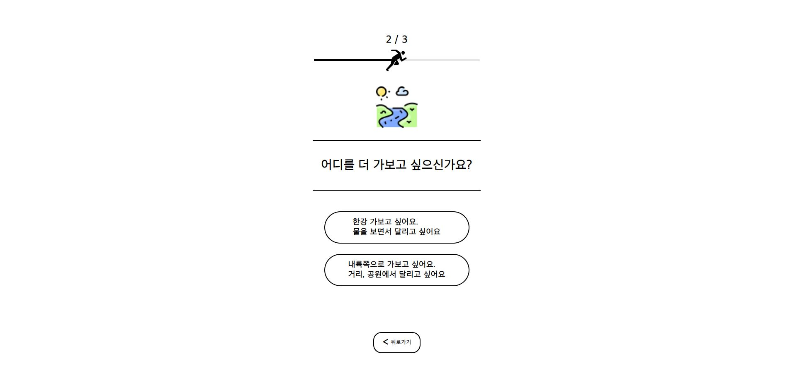
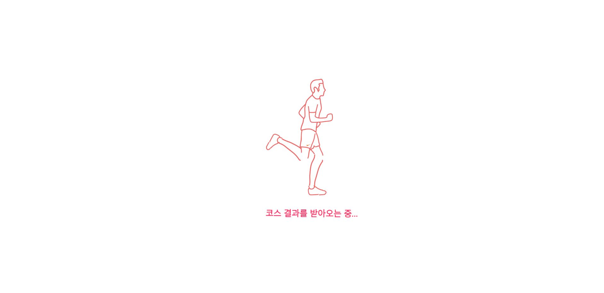
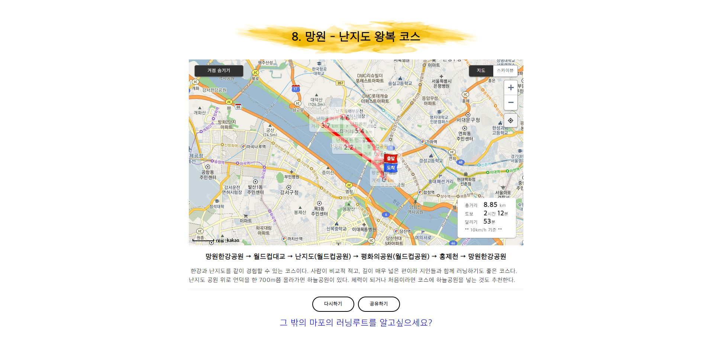

### 모바일

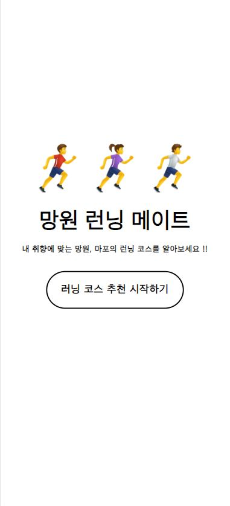
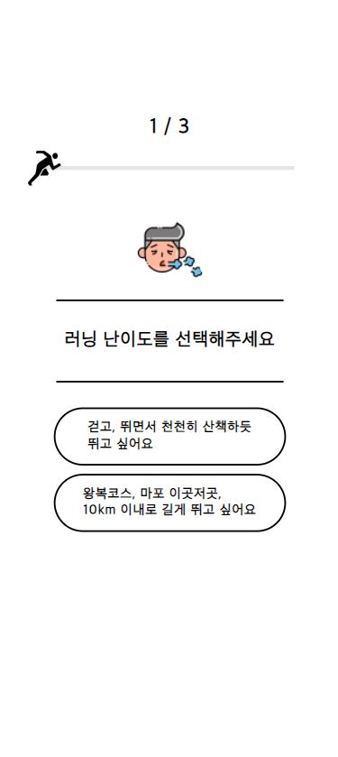
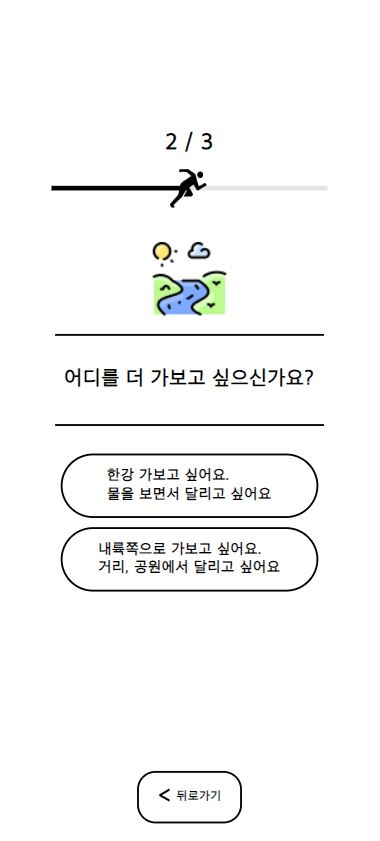
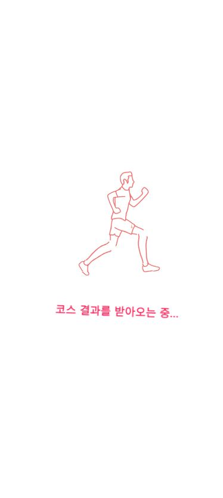
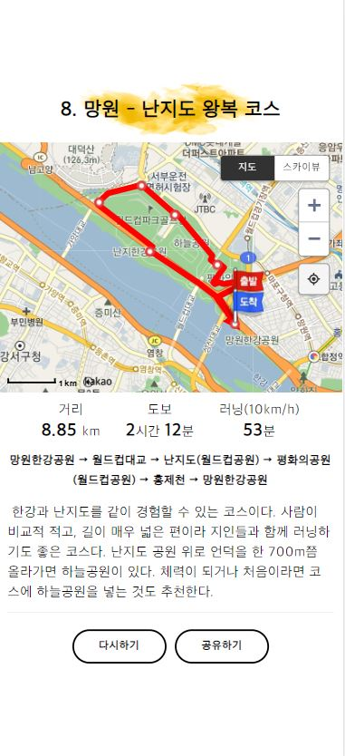
