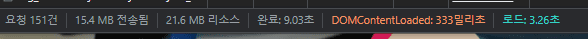

> webpack 5, image lazy loading, image, font size 압축, font preload, woff/woff2 font 사용을 통해
> 단순한 정적 멀티페이지의 로딩 시간을 줄여보았다.

마포청년일자리사업단 : [https://mapo-project.github.io/MaCheongDan/](https://mapo-project.github.io/MaCheongDan) 
Github repository : [https://github.com/Mapo-Project/MaCheongDan](https://github.com/Mapo-Project/MaCheongDan)

## 결과

### LightHouse

성능 최적화를 위한 객관적 지표를 알기 위해 크롬확장프로그램 [lighthouse](https://chrome.google.com/webstore/detail/lighthouse/blipmdconlkpinefehnmjammfjpmpbjk?hl=ko)을 사용했다.

다른 부분은 부족하더라도 성능에 있어서는 최적화가 되었다.

## 최적화 과정

- webpack을 이용해 js, css, html을 모듈화하여 번들링하였다. (main.js를 모듈화하여 2개의 js파일을 하나로 합쳤다.)  
- js, css, html 모두 minimize하고 js는 난독화 해주었다.  
- 첫페이지를 제외한 이미지들에 image lazy loading를 적용하였다. 최근 브라우저에는 사파리를 포함하여 img태그에 loading='lazy'를 설정하여 쉽게 lazy loading을 구현할 수 있다.
<pre><code>
&lt;img
	loading="lazy"
	class="mapo-slogan__img"
	alt="mapo-slogan"
	src="./images/homepage/page_01_001.jpg"
/>
</code></pre>
- [이미지 압축 사이트](https://www.iloveimg.com/ko/compress-image)를 통해 이미지를 압축했다. 70% 가량 압축할 수 있었다.  
- 기존 Noto sans kr 폰트 형식을 otf에서 woff/woff2로 바꾸었다.  font-display:swap으로 사용자에게 빠르게 폰트를 보여줄 수 있도록 했다.
<pre><code>
@font-face {
	font-family: 'Noto Sans KR';
	font-style: normal;
	src: url(./../fonts/noto-sans-kr-v27-korean-900.woff2) format('woff2'),
	url(./../fonts/noto-sans-kr-v27-korean-900.woff) format('woff');
	font-weight: 900;
	font-display: swap;
}
</code></pre>
- 첫 페이지에 나오는 폰트를 빠르게 보여주기 위해 link태그의 rel="preload" 통해 프리로딩하였다.
<pre><code>
&lt;link
	rel="preload"
	href="./fonts/MaruBuri-Bold.woff2"
	as="font"
	type="font/woff2"
	crossorigin
/>
</code></pre>

## 압축 요약

상세파일은 일부만 예로 들었다.

## 성능 분석

구글 크롬 개발자 도구의 네트워크 탭을 이용했다.

### BEFORE

### AFTER

 
**request**

173 → 155

10% 감소

- image lazyloading에 따른 image loading 감소
- noto sans kr woff2 폰트가 font-weight 별로 나뉘어 있어서 font resource의 request 수는 증가
- maru-buri font를 preload하므로 request 하나 증가
- 구글이메일과 연동되어 지속적으로 서버에 요청을 보내므로 점점 늘어남

 
**transferred (네트워크 통한 전송)**

34.9 MB → 15.0 MB

60% 감소

- 전송 시 압축된 자원

 
**resources(페이지에서 로드된 용량)**

44.7MB → 21.3MB

50% 감소

- 압축되지 않은 자원
- image lazyloading에 따른 resource 감소
- html, css, js webpack bundling, minimize, uglify
- font resource 감소
- image resource 감소

 
**finish**

17.77s → 12.05s

30% 감소

- 지속적으로 자원을 요청하므로 큰 의미는 없다.

 
**DOMContentLoaded**

666ms → 1.15s

약 2배 증가 왜 그런지 고민했다.

- 캐시 저장 안하고 새로고침 할 때마다 0.5 ~ 1.5초정도까지 변동이 있었다. 
  DOM이 만들어지면 일어나는 이벤트인데 어디서 문제가 있는지 알 수 없었다. 
  찾아보다가 첫 페이지에 필요 없는 font를 preload한 사실을 깨달았다. 
  이를 해결하니 결과가 다음과 같다.

- 새로고침 할 때마다 0.3 ~ 1초정도까지 변동이 있었다. 
  평균적인 DOMContentLoaded 시간은 줄이긴 했으나 정확한 원리를 알지 못하겠다. 
  preload로 resource download 우선순위가 높아지면 기존 js, css들의 다운로드가 늦어져서 생기는 현상이라고 짐작하고 있다. 
  변동이 생기는 이유는 DOM 만드는 것을 blocking하는 js, css들의 전송에 있어서 서버 상태가 일정하지 않기 때문이라고 판단하였다.

 
**Load**

17.77s → 3.52s

약 80% 감소

- image lazy loading로 인해 필요한 이미지만 요청
- font resource 감소
- image resource 감소

## 후기

&nbsp;기본적인 용량을 줄이는 방법들을 나름대로 적용해봤다. 생각보다 많은 용량을 줄일 수 있었고, 로딩 시간을 많이 줄일 수 있었다.

&nbsp;렌더링을 최적화하기 위해 크롬 개발자 도구 network 탭을 더 공부해 볼 수 있었다. 이미지, 동영상 압축 사이트, lighthouse의 성능 확인 사이트도 접할 수 있었다. 지속적으로 최적화에 대한 관심을 가지고 개발해야겠다.
