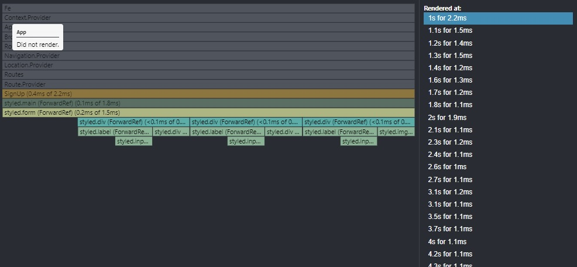

> React.memo, React.lazy, suspense를 이용한 리액트 웹앱 성능 개선

## memoization

memoization은 이전에 사용한 값을 저장해두고 동일한 계산 값에 대해 저장된 값을 사용하는 최적화 방법을 말한다. React에서는 useMemo, useCallback, React.memo를 이용해 memoization을 적용할 수 있다. useMemo는 값을, useCallback은 함수를 memoization하는 Hook이고, React.Memo는 컴포넌트를 memoization하는 HOC(high order component), 고차 컴포넌트다.

 

React의 컴포넌트는 부모컴포넌트가 리렌더링될때, state, props가 변경될때 리렌더링 된다. 메인 페이지는 data state를 각 컴포넌트들에게 전달한다.
메인 페이지에서 특정 게시글의 하트를 누른다면 그 게시글 컴포넌트만 리렌더링이 되어야한다. 하지만 하트를 누르는 순간 부모컴포넌트의 state가 변경되고, 부모컴포넌트가 리렌더링되어서 하위 컴포넌트들도 모두 리렌더링된다. 이를 해결하기 위해 useCallback과 React.memo를 사용했다.

 
<pre><code>// 렌더링마다 useNavigate()의 값이 달라져서 useCallback을 이용해 memoization하였다.

    const onSelectAdditionalTown = useCallback(() => {
    navigate('/town/regist');
    }, [navigate]);

</code></pre>
 

부모와 자식 컴포넌트를 분리하고 자식 컴포넌트에 React.memo를 이용했다.

<pre><code>// React.memo는 객체를 얕은 비교한다. 
// 하트 값이 달라진 것만 비교하기 위해 두번째 인자로 비교함수 areEqual을 사용했다.

    // 하트 변경되지 않으면 리렌더링 되지 않게
    function areEqual(prevProps, nextProps) {
    if (
        prevProps.itemId === nextProps.itemId &&
        prevProps.itemsHeartCount === nextProps.itemsHeartCount
    ) {
        return true;
    }
    return false;
    }

    // 자식 컴포넌트
    const MainItems = React.memo(function MainItems({
        ...props들
        }){
            return(
                ...컴포넌트 요소
            )
        }, areEqual);

    export default MainItems;

</code></pre>
 

memoization 결과 게시글의 하트를 누르면 하트를 눌러 하트 개수가 변한 컴포넌트만 리렌더링 되었다.

그 밖에도 signup, create 페이지를 같은 식으로 memoization하였다. react의 profile을 이용해 성능을 체크해보았다.

다음은 signup페이지에서 id Input창에서 id값을 변경했을 때를 profile을 이용해 비교한 모습이다.

### memoization 이전

### memoization 이후

렌더링 시간이 2.2ms에서 0.6ms로 거의 1/4로 줄어든 것을 볼 수 있다. 

## code spliting

code spliting이란 js파일을 쪼개는 것을 말한다. 예를 들어 100mb용량의 js번들이 있다면 클라이언트에서 한번에 다운로드 받는 것은 오래걸린다. CSR의 경우 첫 화면을 로딩하는 데 시간이 오래걸릴 것이다. 100mb짜리 js파일을 여러개로 쪼개서 우선순위를 두어 로딩한다면 사용자 경험을 향상 시킬 수 있다. react CRA는 기본적으로 webpack을 사용한다. webpack을 통해 모듈들을 bundling하고 chuck로 나누어 code spliting을 할 수 있다. webpack에선 동적 import를 통해 code spliting을 할 수 있다. react에서는 동적 import로 컴포넌트들을 code spliting하기 위해 React.lazy 함수를 이용한다. @loadable/component을 사용해봤지만 현재 앱에서는 lazy로도 충분히 code spliting이 가능하므로 기본 내장된 lazy와 suspense를 이용했다.

 

보통 라우트를 기준으로 code spliting을 한다. App component에서 code spliting 하였다. fallback option을 통해 로딩중에 띄울 컴포넌트나 태그를 지정할 수 있다. fallback을 loading spinner를 넣어봤으나 오히려 UX를 헤친다고 생각해 제거했다.

 
<pre><code> // App.js 일부

    // code spliting
    const Login = lazy(() => import('./pages/Login'));
    const SignUp = lazy(() => import('./pages/SignUp'));
    ...
    const Test = lazy(() => import('./pages/Test'));

    ...

    function App() {
        return (
            < Suspense>
                < Routes>
                    <Route
                    path="/"
                    element={
                        <Main
                        mainData={mainData}
                        onClickHeart={onClickHeart}
                        nonMemberTown={nonMemberTown}
                        />
                    }
                    />
                    <Route path="/search" element={<CategorySearch />} />
                    ...
                    <Route path="/test" element={<Test />} />
                </Routes>
            </Suspense>
        );
    }

</code></pre>

### code spliting 이전

### code spliting 이후

code spliting 이후 speed index가 빨라졌다. 첫 페이지를 불러오는데 시간이 빨라졌음을 의미한다.

### chuck

다른 라우트로 접근하면 분할된 chuck를 lazy 로딩 하는 것을 확인 할 수 있다.

## 후기

memoization과 code spliting을 통해 리액트 웹앱 성능을 향상시켜보았다. memoization의 경우 memory에 저장되는 저장비용, 연산 비용이 리렌더링으로 감소되는 비용보다 클때가 있어 조심스럽게 사용해야한다고 한다. 이는 좀 더 알아봐야할 부분이다. 

code spliting을 통해 첫페이지를 빠르게 불러왔지만 다른 페이지로 이동할때, 깜빡임 현상이 발생하고 있다. fallback을 이용해 로딩 컴포넌트를 넣어보았으나 UX가 좋지 않다. 아직 많은 API를 불러오는 것도 아니고 앱의 번들 자체도 6mb정도로 작기 때문에 code spliting을 통한 성능 개선보다 spa 자체의 smooth한 화면 전환 UX를 유지하는 것이 좋아보였다. 번들이 더 커지거나, skeleton UI 및 image caching을 쓰기 전까지는 code spliting을 쓰지 말아야겠다. lazy와 loadable을 통해 react의 code spliting을 경험해본 정도의 의의가 있었다.

